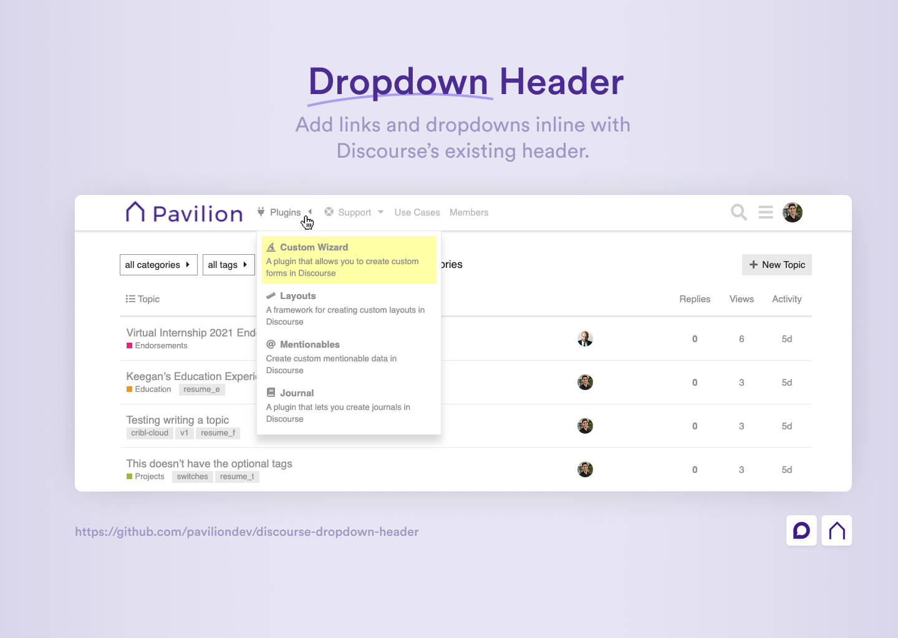

# Discourse Dropdown Header

## 🔍 Overview

This theme component allows you to add links and dropdowns in the header of your Discourse site.



## 🔗 Info &amp; Links

| Title                 | Link                                                                                                 |
| --------------------- | ---------------------------------------------------------------------------------------------------- |
| 📰 **Meta Topic**     | [Read Topic](https://meta.discourse.org/t/dropdown-header/226170)                                    |
| 👨‍💻 **Author**         | [Keegan George](https://github.com/keegangeorge/)                                                    |
| #️⃣ **Version**        | `1.0`                                                                                                |
| ❓ **How to Install** | [Installation Guide](https://meta.discourse.org/t/how-do-i-install-a-theme-or-theme-component/63682) |
| 🐛 **Found a bug?**   | [Submit a bug report](https://thepavilion.io/w/bug-report/steps/intro)                               |
| ✋ **Have an idea?**  | [Submit a feature request](https://thepavilion.io/w/bug-report/steps/intro)                          |

## ⚙️ Settings

There are a variety of settings that you can configure to setup the component unique to your site.

### `header_links`

This setting is used to define the links that will be displayed in the top-level of the header.

To create links, click the ✏️ **Launch Editor** button and fill in the requried fields.

The fields presented include:

- `id`: A unique identifier for the link (this id will be used for reference if a link has a dropdown attached to it)
- `title`: The text that will be displayed in the link
- `icon` (optional): The icon that will be displayed in the link. Enter a font-awesome icon class or a URL to an image _(Note: use the `icon_source` theme setting to define which source to use)_
- `url` (optional): The URL that the link will point to. This may be left empty if the link only serves as a dropdown and has no destination in itself.

### `dropdown_links`

This setting is used to define the dropdown menus that will be attached to the links defined in the `header_links` setting.

To create dropdown links, click the ✏️ **Launch Editor** button and fill in the requried fields.

The fields presented include:

- `headerLinkId`: This is the `id` of the header_link that the dropdown is attached to (defined in the `header_links` setting)
- `title`: The text that will be displayed for the dropdown link item
- `icon` (optional): The icon that will be displayed in the link. Enter a font-awesome icon class or a URL to an image _(Note: use the `icon_source` theme setting to define which source to use)_
- `url`: The URL that the dropdown link will point to.
- `description` (optional): A description that will be shown below the title for more information about the link.

### `icon_source`

This setting is used to select where to source icons from (image url or Font Awesome class). This source will be used for the inputs you use in the `header_links` and `dropdown_links` icon settings.

### `security`

Adds security to a link by allowing only a specific group/trust level to see the link. This can be used, for example to show certain links only to staff members or members of a specific group.

To add security to a link, click the ✏️ **Launch Editor** button and fill in the requried fields.

The fields presented include:

- `headerLinkId`: This is the `id` of the header_link defined in the `header_links` setting.
- `title`: This is the name of the group that will be allowed to see the link.

### `links_position`

This setting is used to define where the links will be displayed in the header.

- `Left`: places the links to the right of the site logo
- `Right`: places the links to the left of the header icons (i.e. search, hamburger, user).

### `show_caret_icons`

This setting is used to toggle on/off the caret icons that appear next to the dropdown links.

### Customization Settings:

There are a variety of settings that allow you to define the colors of parts of the theme component. Here you may enter any CSS color value such as a HEX code, RGB value, HSB value, etc. You may also use existing CSS custom properties as the values. In fact, it is recommended that you do so and the defaults make use of CSS custom properties. This ensures that the customizations will be support for dark and light themes.

The customizations available include:
| Setting | Description |
| --------------------- | --------------------------------------------------------------------------------- |
|`main_link_color` | The color of the text for top level links |
|`main_link_hover_color` | The color of the text for top level links when hovered over |
| `dropdown_background_color` | The background color of dropdowns |
|`dropdown_border_color` | The border color of dropdowns |
| `dropdown_item_color`| The text color of dropdown link items |
| `dropdown_item_hover_color` | The text color of dropdown link items when hovered over |
| `dropdown_item_hover_background_color` | The background color of a dropdown item when hovered over |

Note: Even further customizations can be made by adding custom CSS to your Discourse site. Doing so you can target specific links by their title names. An example of adding custom colors to each dropdown link is shown in the following CSS snippet.

<details>
<summary>See Snippet</summary>

```css
.custom-header-dropdown [title="Custom Wizard"] {
  color: rgb(0, 140, 255);
  background-color: rgba(0, 140, 255, 0.1);
}

.custom-header-dropdown [title="Layouts"] {
  color: #d1ae00;
  background-color: rgba(#ffd500, 0.1);
}

.custom-header-dropdown [title="Mentionables"] {
  color: #068f2d;
  background-color: rgba(#068f2d, 0.1);
}

.custom-header-dropdown [title="Journal"] {
  color: #8f0606;
  background-color: rgba(#8f0606, 0.1);
}
```

</details>

### `svg_icons`

This setting is used to add to add Font Awesome 5 icons to the site's svg icon subset. This may be necessary if using a Font Awesome icon that is not already used in a Discourse site. Adding that Font Awesome icon class to this setting will add it to the site's icon dependency list and allow for it to be used succesfully.

## 🎬 Preview:

**Desktop:**


**Mobile:**
Due to lack of space on mobile, links can be triggered by tapping on the arrow down button.

